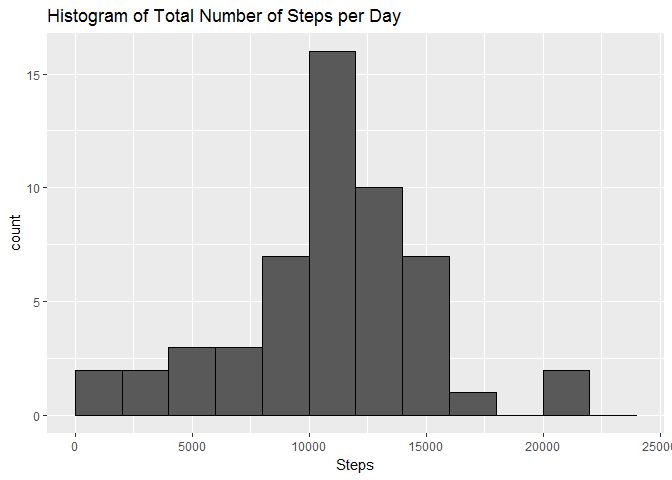
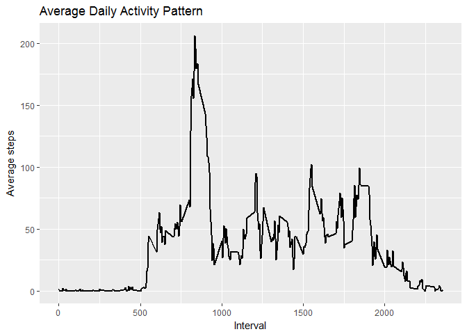
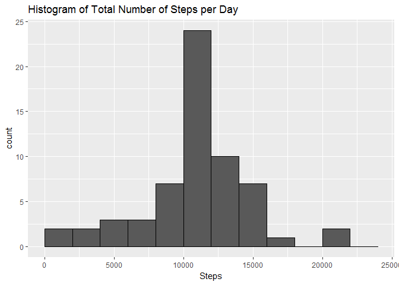
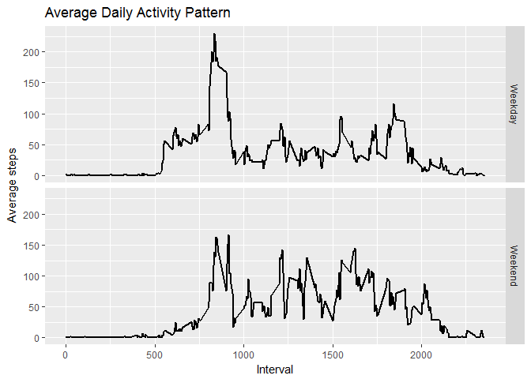

# Reproducible Research - Project 1
Chieh-Ju Lin  
09/01/2017  

Load the data and check it


```r
data <- read.csv("activity.csv")
head(data)
```

```
##   steps       date interval
## 1    NA 2012-10-01        0
## 2    NA 2012-10-01        5
## 3    NA 2012-10-01       10
## 4    NA 2012-10-01       15
## 5    NA 2012-10-01       20
## 6    NA 2012-10-01       25
```

```r
tail(data)
```

```
##       steps       date interval
## 17563    NA 2012-11-30     2330
## 17564    NA 2012-11-30     2335
## 17565    NA 2012-11-30     2340
## 17566    NA 2012-11-30     2345
## 17567    NA 2012-11-30     2350
## 17568    NA 2012-11-30     2355
```

```r
str(data)
```

```
## 'data.frame':	17568 obs. of  3 variables:
##  $ steps   : int  NA NA NA NA NA NA NA NA NA NA ...
##  $ date    : Factor w/ 61 levels "2012-10-01","2012-10-02",..: 1 1 1 1 1 1 1 1 1 1 ...
##  $ interval: int  0 5 10 15 20 25 30 35 40 45 ...
```


* Let's first check some simple plot and statistics

Format the data and calculate the total number of steps taken per day


```r
library(dplyr)
```

```
## Warning: package 'dplyr' was built under R version 3.3.3
```

```
## 
## Attaching package: 'dplyr'
```

```
## The following objects are masked from 'package:stats':
## 
##     filter, lag
```

```
## The following objects are masked from 'package:base':
## 
##     intersect, setdiff, setequal, union
```

```r
data_1 <- na.omit(data)
by_date <- group_by(data_1, date)
total_steps <- summarise(by_date, sum(steps, na.rm = TRUE))
names(total_steps) <- c("date", "steps")
total_steps
```

```
## # A tibble: 53 x 2
##          date steps
##        <fctr> <int>
##  1 2012-10-02   126
##  2 2012-10-03 11352
##  3 2012-10-04 12116
##  4 2012-10-05 13294
##  5 2012-10-06 15420
##  6 2012-10-07 11015
##  7 2012-10-09 12811
##  8 2012-10-10  9900
##  9 2012-10-11 10304
## 10 2012-10-12 17382
## # ... with 43 more rows
```

Build histogram


```r
library(ggplot2)
```

```
## Warning: package 'ggplot2' was built under R version 3.3.2
```

```r
g <- ggplot(total_steps, aes(steps))
g <- g + geom_histogram(breaks = seq(0, 25000, by = 2000), color = "black")
g <- g + labs(title = "Histogram of Total Number of Steps per Day", x = "Steps")
g
```

<!-- -->

The mean of the total number of steps taken per day is:


```r
mean(total_steps$steps)
```

```
## [1] 10766.19
```

The median of the total number of steps taken per day is:


```r
median(total_steps$steps)
```

```
## [1] 10765
```


* Now, let's check the average daily activity pattern

Format the data


```r
data_2 <- group_by(data, interval)
by_interval <- summarise(data_2, average_steps = mean(steps, na.rm = TRUE))
by_interval
```

```
## # A tibble: 288 x 2
##    interval average_steps
##       <int>         <dbl>
##  1        0     1.7169811
##  2        5     0.3396226
##  3       10     0.1320755
##  4       15     0.1509434
##  5       20     0.0754717
##  6       25     2.0943396
##  7       30     0.5283019
##  8       35     0.8679245
##  9       40     0.0000000
## 10       45     1.4716981
## # ... with 278 more rows
```

Build a time series plot of the 5-minute interval and the average number of steps taken


```r
g <- ggplot(by_interval, aes(interval, average_steps))
g <- g + geom_line(aes(x = interval, y = average_steps), size = 1)
g <- g + labs(x = "Interval", y = "Average steps", title = "Average Daily Activity Pattern")
g
```

<!-- -->

Looks like on average people have highest number of steps during the morning

Which 5-minute interval, on average across all the days in the dataset, contains the maximum number of steps?


```r
by_interval[which.max(by_interval$average_steps), ]
```

```
## # A tibble: 1 x 2
##   interval average_steps
##      <int>         <dbl>
## 1      835      206.1698
```


* Let's handle the missing values

How many missing values in the dayaset?


```r
summary(data)
```

```
##      steps                date          interval     
##  Min.   :  0.00   2012-10-01:  288   Min.   :   0.0  
##  1st Qu.:  0.00   2012-10-02:  288   1st Qu.: 588.8  
##  Median :  0.00   2012-10-03:  288   Median :1177.5  
##  Mean   : 37.38   2012-10-04:  288   Mean   :1177.5  
##  3rd Qu.: 12.00   2012-10-05:  288   3rd Qu.:1766.2  
##  Max.   :806.00   2012-10-06:  288   Max.   :2355.0  
##  NA's   :2304     (Other)   :15840
```

```r
sum(is.na(data$steps))
```

```
## [1] 2304
```

Let's simply use the mean for each 5-minute interval to replace the missing values here and create a new dataset


```r
# Create a new column with average steps by interval
rep <- rep(by_interval$average_steps, 61)
data_new <- mutate(data, average_steps = rep)

# Replace NA with average steps using for loop
for (i in 1:17568){
        if (is.na(data_new$steps[i]) == TRUE){
                data_new$steps[i] <- data_new$average_steps[i]
        }
}

# Check NAs
sum(is.na(data_new$steps))
```

```
## [1] 0
```

```r
# Drop the new column
data_new <- data_new[, c(1:3)]
head(data_new)
```

```
##       steps       date interval
## 1 1.7169811 2012-10-01        0
## 2 0.3396226 2012-10-01        5
## 3 0.1320755 2012-10-01       10
## 4 0.1509434 2012-10-01       15
## 5 0.0754717 2012-10-01       20
## 6 2.0943396 2012-10-01       25
```

Let's make a new histogram for the new dataset


```r
# Group steps by date
data_3 <- group_by(data_new, date)
by_date_new <- summarise(data_3, steps = sum(steps))
head(by_date_new)
```

```
## # A tibble: 6 x 2
##         date    steps
##       <fctr>    <dbl>
## 1 2012-10-01 10766.19
## 2 2012-10-02   126.00
## 3 2012-10-03 11352.00
## 4 2012-10-04 12116.00
## 5 2012-10-05 13294.00
## 6 2012-10-06 15420.00
```

```r
# Build histogram
g <- ggplot(by_date_new, aes(steps))
g <- g + geom_histogram(breaks = seq(0, 25000, by = 2000), color = "black")
g <- g + labs(title = "Histogram of Total Number of Steps per Day", x = "Steps")
g
```

<!-- -->

The mean of the total number of steps taken per day for the new dataset is:


```r
mean(by_date_new$steps)
```

```
## [1] 10766.19
```

The median of the total number of steps taken per day for the new dataset is:


```r
median(by_date_new$steps)
```

```
## [1] 10766.19
```

As we can see, the mean steps maintain the same, while the median steps increase a little bit  
  
  
  
* Let's further check if there are differences in activity patterns between weekdays and weekends

We first create a new factor variable in the dataset with two levels – “weekday” and “weekend” indicating whether a given date is a weekday or weekend day


```r
head(data_new)
```

```
##       steps       date interval
## 1 1.7169811 2012-10-01        0
## 2 0.3396226 2012-10-01        5
## 3 0.1320755 2012-10-01       10
## 4 0.1509434 2012-10-01       15
## 5 0.0754717 2012-10-01       20
## 6 2.0943396 2012-10-01       25
```

```r
Sys.setlocale("LC_TIME", "English")
```

```
## [1] "English_United States.1252"
```

```r
data_new$day_of_week <- weekdays(as.Date(data_new$date))
for (i in 1:17568) {
        if (data_new$day_of_week[i] %in% c("Monday", "Tuesday", "Wednesday", "Thursday", "Friday")){
                data_new$day_of_week[i] <- "Weekday"
        }
        else{ 
                data_new$day_of_week[i] <- "Weekend"
        }
}
table(data_new$day_of_week)
```

```
## 
## Weekday Weekend 
##   12960    4608
```

Then let's format the dataset and make a panel plot


```r
# Group the data by day_of_week and interval
data_4 <- group_by(data_new, day_of_week, interval)
by_interval_2 <- summarise(data_4, steps = mean(steps))
head(by_interval_2)
```

```
## # A tibble: 6 x 3
## # Groups:   day_of_week [1]
##   day_of_week interval      steps
##         <chr>    <int>      <dbl>
## 1     Weekday        0 2.25115304
## 2     Weekday        5 0.44528302
## 3     Weekday       10 0.17316562
## 4     Weekday       15 0.19790356
## 5     Weekday       20 0.09895178
## 6     Weekday       25 1.59035639
```

```r
# Make a panel plot containing a time series plot
g <- ggplot(by_interval_2, aes(x = interval, y = steps))
g <- g + geom_line(size = 1) + facet_grid(day_of_week~.)
g <- g + labs(x = "Interval", y = "Average steps", title = "Average Daily Activity Pattern")
g
```

<!-- -->

During the weekdays, people tend to have the highest number of steps in the morning  
And during the weekends, the activity pattern have multiple peaks
